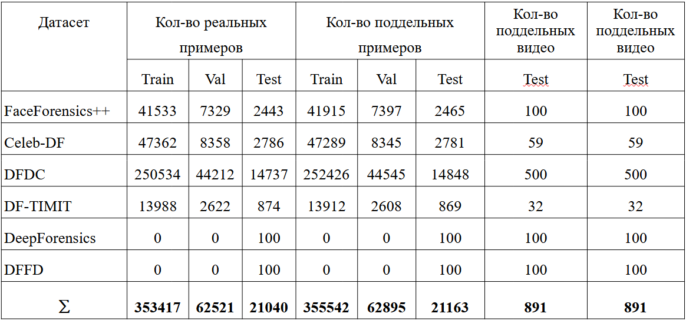

# DeepFakeFacefromFrameDataset

Ссылка на датасет: https://www.kaggle.com/datasets/fakazuma/FrameFaceDeepFakeDataset

## 1. Начало работы 

- Установить Kaggle API:
```python
pip install kaggle
```

- Скачать датасет:
```python
import os
os.environ['KAGGLE_USERNAME'] = "uname" # username from the json file
os.environ['KAGGLE_KEY'] = "kaggle_key" # key from the json file
!kaggle datasets download -d FrameFaceDeepFakeDataset
```

- Положить файл info.csv в директорию датасета

## 2. Описание датасета

Датасет состоит из поддельных и реальных изображений, которые были получены 
из отдельных кадров видео, с помощью кроппинга области лица. Также была включена подвыборка,
состоящая из видеофайлов для тестирования модели.

Исходные видео включают данные из датасетов, представленных в таблице:


Суммарное количество изображений: 876578

## 3. Метод создания датасета

Исходно ни один из этих датасетов не имеет сбалансированное количество реальных и фейковых видео. 
Для решения этой задачи, из каждого видео извлекалось различное количество фреймов, так, 
чтобы внутри одного датасета количество реальных и поддельных фреймов совпадало. 

При деление получившегося датасета на тренировочную, валидационную и тестовую выборку соблюдалось несколько правил: 
- Конечное отношение train/val/test: 80:15:5
- Один и тот же актер может входить только в одно из разбиений
- Если в датасете дана дополнительная информация по полу, возрасту, расе и т.д. то такие категории так же разбивались в соотношении 80:15:5
- Добавить в тестовую часть примеров, которые были сгенерированы отличным от тренеровочной и валидационной выборок способом. Эти примеры необходимы для проверки модели на робастность (устойчивость к новым видам генерации фейков). В качестве такого датасета был выбран DeepForensics и DFFD.
- Извлекать фреймы из видео случайным образом для повышения разнообразия датасета 

После извлечения фреймов из видеофайлов проводилась дедупликация, чтобы исключить из выборки идентичные фреймы (например, фреймы, которые идут подряд, где актер находится в статическом положении или фреймы из одинаковых видео среди разных датасетов). 

К оставшимся данным применялась модель детекции лиц TinaFace (Выбор основан на тестировании на датасете WIDER). Если 
лиц не было найдено или было найдено более 2х лиц - такой кадр отбрасывался.
